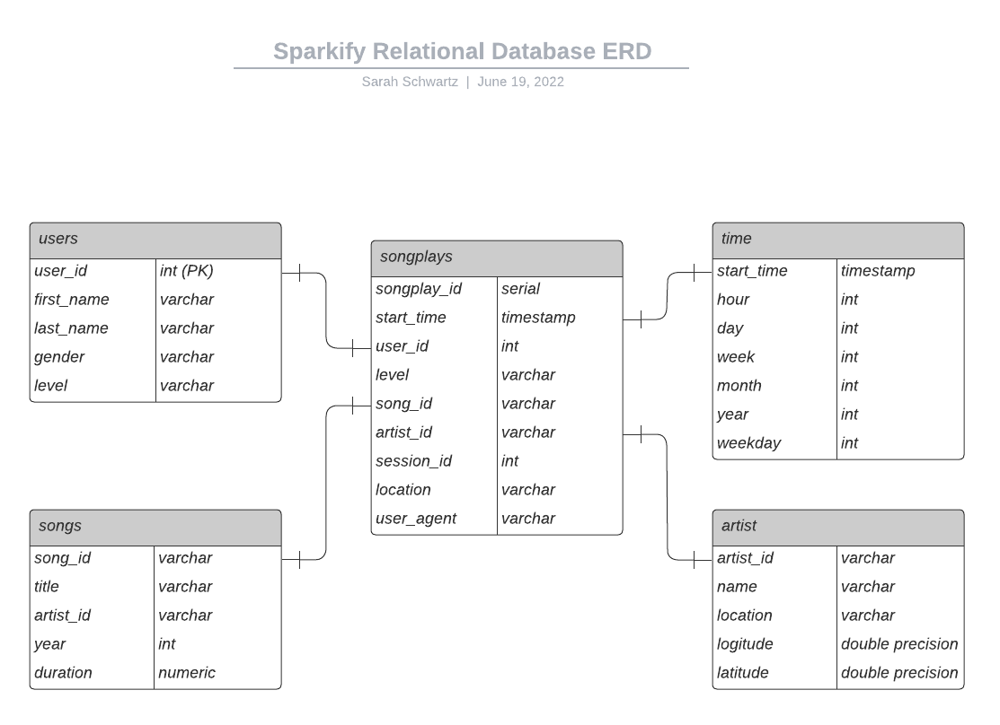

# Project: Data Lake
## Introduction
A music streaming startup, Sparkify, has grown their user base and song database even more and want to move their data warehouse to a data lake. Their data resides in S3, in a directory of JSON logs on user activity on the app, as well as a directory with JSON metadata on the songs in their app.

As their data engineer, you are tasked with building an ETL pipeline that extracts their data from S3, processes them using Spark, and loads the data back into S3 as a set of dimensional tables. This will allow their analytics team to continue finding insights in what songs their users are listening to.

## Project Description
In this project, you'll apply what you've learned on Spark and data lakes to build an ETL pipeline for a data lake hosted on S3. To complete the project, you will need to load data from S3, process the data into analytics tables using Spark, and load them back into S3. You'll deploy this Spark process on a cluster using AWS.

## Data
For this project there are two types of JSON data files that were used. The first is the song data set contains metadata about a song and the artist of that song.
The second is the the log data set that contains simulated activity logs from a music streaming app based on specified configurations.

The following is an example of the song data. 

The following is an example of the log data. 

## Database Schema

The database model for the Redshift database is a denormalized star schema and the entity Relationship Diagram is as follows: 

## Files
- `dl.cfg` is an example of the configuration file with the keys removed for security purposes.

- `etl.py` processes the JSON files and calls the COPY and INSERT queries from `sql_queries.py` to load them into the Sparkify redshift database.

## ETL

- If not already installed, install all packages imported in `etl.py`
  - example `pip install pyspark`
- Create an IAM user with Administrator permissions
  - save keys in `dl.cfg`
- set up a EMR cluster
- create EMR notebook
- run `etl.py`
