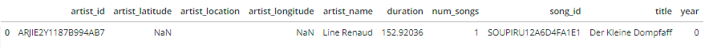

# Project: Data Modeling with Postgres

## Introduction
A startup called Sparkify wants to analyze the data they've been collecting on songs and user activity on their new music streaming app. The analytics team is particularly interested in understanding what songs users are listening to. Currently, they don't have an easy way to query their data, which resides in a directory of JSON logs on user activity on the app, as well as a directory with JSON metadata on the songs in their app.

They'd like a data engineer to create a Postgres database with tables designed to optimize queries on song play analysis, and bring you on the project. Your role is to create a database schema and ETL pipeline for this analysis. 

## Project Description
In this project, I applied what I have learned on data modeling with Postgres and build an ETL pipeline using Python. To complete the project, I defined fact and dimension tables for a star schema for a particular analytic focus, and wrote an ETL pipeline that transfers data from files in two local directories into these tables in Postgres using Python and SQL. 

## Files

- `create_tables.py` drops and creates all tables defined in `sql_queries.py`. 
- `sql_queries.py` contains all CREATE, INSERT, and DROP queries used in the ETL process. Called in `etl.py` and `etl.ipynb`.
- `etl.py` processes the JSON files and calls the INSERT queries from `sql_queries.py` to load them into the Sparkify dattabase.
- `etl.ipynb`  a test run of the functions in `etl.py` which process and load data from a single JSON file at a time.
- `test.ipynb` tests all queries from `sql_queries.py` to ensure that the CREATE and INSERT queries are properly set up. 
- `data_exploration.ipynb` contains data exploration to study the format and structure of the JSON data files

## Data
For this project there are two types of JSON data files that were used. The first is the song data set contains metadata about a song and the artist of that song.
The second is the the log data set that contains simulated activity logs from a music streaming app based on specified configurations.

### Song Data

### Log Data

The following is an example of the log data.

## Entity Relationship Diagram

The database model for this progect is a denormalized start schema and the entity Relationship Diagram is as follows.

## ELT Pipeline
Extract, transform, load (ETL) is the general procedure of copying data from one or more sources into a destination system which represents the data differently from, or in a different context than, the sources.

### Extracting, Transforming, and Loading the Data

The ETL pipeline extracts two types of JSON data files from files in two directories:

- /data/log_data 
- /data/song_data

Data is extracted from the JSON files and transformed into the appro

This is handled by four files using Python and SQL:

- The relations for the  Sparkify database are created by running `create_tables.py`.
- Data is extracted, transformed and loaded into the database using `etl.py`.
- All SQL queries for called in the aformentioned scripts are located in `sql_queries.py`
- The relations from the database are checked using `test.ipynb` to confirm the data was correctly transformed and loaded into the database and the appropriate data types were used.

Running the the ELT pipline:
- Open a terminal and run \<python create_tables.py\>
    - All relations will be created for the database
- Run \<python etl.py\>
    - Data will be extracted from the JSON files and transformed and loaded into the Sparkify database.
- Run all cells in `test.ipynb` 
    - Confirms that the relations were properly created and the data was loaded successfully.
  
