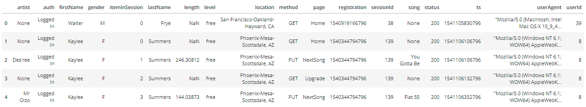

# Project: Data Modeling with Postgres

## Project Description

## Files

- create_tables.py
- sql_queries.py
- etl.py
- etl.ipynb
- test.ipynb
- data_exploration.ipynb

## Data
For this project there are two types of JSON data files that were used. The first is the song data set contains metadata about a song and the artist of that song.
The second is the the log data set that contains simulated activity logs from a music streaming app based on specified configurations.

### Song Data

### Log Data

The following is an example of the log data.

## Entity Relationship Diagram

The database model for this progect is a denormalized start schema and the entity Relationship Diagram is as follows.

##
