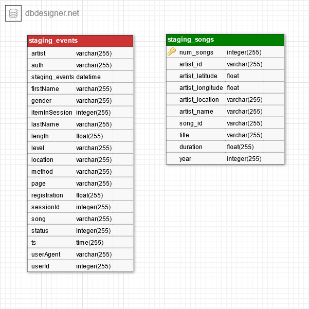
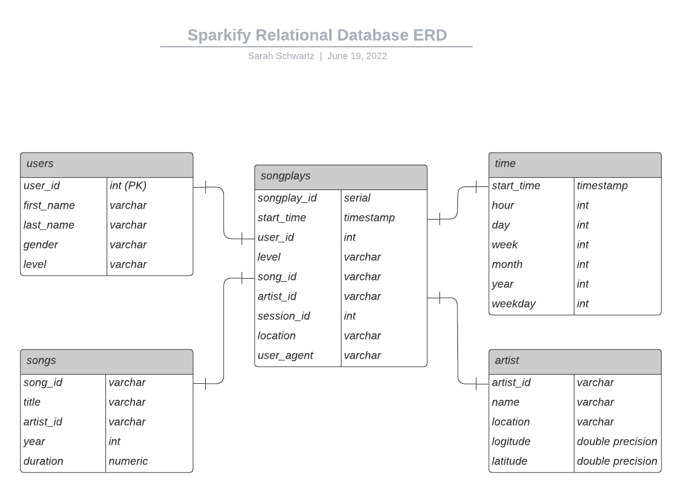
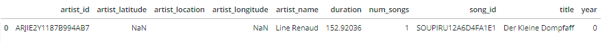
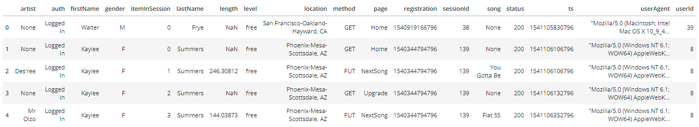

Project: Data Warehouse

## Introduction

A music streaming startup, Sparkify, has grown their user base and song database and want to move their processes and data onto the cloud. Their data resides in S3, in a directory of JSON logs on user activity on the app, as well as a directory with JSON metadata on the songs in their app.

I built an ETL pipeline that extracts their data from S3, stages them in Redshift, and transforms data into a set of dimensional tables for their analytics team to continue finding insights into what songs their users are listening to. You'll be able to test your database and ETL pipeline by running queries given to you by the analytics team from Sparkify and compare your results with their expected results.

## Project Description

In this project, I applied what I have learned on data warehouses and AWS to build an ETL pipeline for a database hosted on Redshift. I will loaded data from S3 to staging tables on Redshift and execute SQL statements that create the analytics tables from these staging tables.


## Database Schema
The ERD for the staging tables are as follows: </br>


The database model for the Redshift database is a denormalized star schema and the entity Relationship Diagram is as follows:</br>


## Data
For this project there are two types of JSON data files that were used. The first is the song data set contains metadata about a song and the artist of that song.
The second is the the log data set that contains simulated activity logs from a music streaming app based on specified configurations.

The following is an example of the song data.</br>




The following is an example of the log data.</br>



## ETL
The ETL pipeline executes the following steps:
- Run all but the last three cells in the `create_redshift_cluster.ipynb`
- `create_redshift_cluster.ipynb` will create:
    - ec2 client
    - s3 client
    - iam client
    - redshift client
    - redshist cluster
- Open a terminal and run \<python create_tables.py\>
    - All relations will be created for the redshift database
- Run \<python etl.py\>
    - Data will be copied from the S3 bucket to the staging tables redshift database, and the data will be transformed and inserted into the relations.
- Perform any desired queries on Redshift's Query editor
- Return to `create_redshift_cluster.ipynb` and run the last three cells to ensure that the cluster is delected and you are no longer being charged.


## Files
- `create_redshift_cluster.ipynb` creates the needed clients (ec2, s3, iam, redshift), and creates the redshift cluster.
- `create_tables.py` drops and creates all tables defined in `sql_queries.py`. 
- `sql_queries.py` contains all CREATE, COPY, INSERT, and DROP queries used in the ETL process. Called in `etl.py`.
- `etl.py` processes the JSON files and calls the COPY and INSERT queries from `sql_queries.py` to load them into the Sparkify redshift database.

## Queries

Example queries run on the new redshift database include:

Query:
```SELECT COUNT(*) as num_artists
FROM artists;
```

Returns:
```num_artists
10025
```

and 

Query:
```
SELECT *
FROM songs
WHERE year=1989
LIMIT 10;
```

Returns:
```
song_id,title,artist_id,year,duration
SOCUSNQ12A8C138A86,Never Gonna Be The Same,AR6QQY41187B990574,1989,167.13098
SOOVHYF12A8C134892,I'll Be Waiting,ARCLYBR1187FB53913,1989,304.56118
SOXWACL12A6D4F414B,All The Answers,AR2HXXS1187B9AF3E2,1989,227.73506
SOTFECF12AB0180627,Tekila Gerila,ARCYLSH1187FB411D5,1989,211.93098
SOWYNAH12A8C143A01,The Nightingale (Album Version),AR0737R1187B99F0E2,1989,296.202
SOXIYFY12AB018529B,Ne trebam te,ARIHVRZ1187FB3EADB,1989,226.11546
SOMICHX12AB0189832,Please Forgive Us (LP Version),AR9GUZF1187FB4D1BC,1989,204.19873
SOWWLVP12A8C138BFB,Magdalaine,ARHONG11187FB3B120,1989,398.44526
SOITOFS12A81C21D00,Camino,AR2UQQ51187B9AC816,1989,303.09832
SOJJTSZ12AB018C056,Niotkuda,ARIHVRZ1187FB3EADB,1989,295.10485
```
